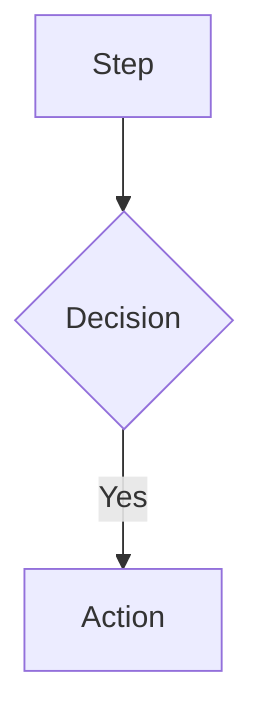

# Complit - Project Context

Cross-platform app (web + mobile) for personal goal management with milestones and evidence tracking.

## Entities

### Goals
| Field | Type | Notes |
|-------|------|-------|
| id | string | unique |
| title | string | **required** |
| description | string? | optional detail |
| targetDescription | string? | completion criteria |
| durationInMonths | number? | estimated time |
| priority | low/medium/high | user-defined |
| status | active/completed/paused | |
| order | number | manual sorting |
| createdAt/completedAt | date | |

### Milestones
| Field | Type | Notes |
|-------|------|-------|
| id | string | unique |
| goalId | string | parent goal |
| title | string | **required** |
| description | string? | |
| status | pending/in_progress/completed | |
| order | number | within goal |
| createdAt/completedAt | date | |

### Evidence
| Field | Type | Notes |
|-------|------|-------|
| id | string | unique |
| goalId | string | **required** |
| milestoneId | string? | optional link |
| content | string | what was done |
| createdAt/updatedAt | date | |

## Business Rules

**Goals:**
- Must have title
- User controls status changes freely
- Completed when user decides target is reached

**Milestones:**
- Visual breakdown of goal progress
- Non-linear: no required order
- CRUD + reorder freely

**Evidence:**
- Immutable history (edit allowed, no delete)
- Can be added anytime
- Ordered by createdAt by default

## Key Flows

1. **Create goal** → title required → status: active → add milestones/evidence
2. **Track progress** → view goals by priority → log evidence → mark milestones done
3. **Reorder** → drag-drop or buttons → persist immediately
4. **Complete goal** → user marks done → record completedAt

## Tech Requirements

- Sync frontend ↔ backend
- Persist reordering immediately
- Validate title on goal creation
- Evidence: preserve history via updatedAt

---

## Documentation Sync

### Dual-Purpose Docs
Files in `docs/` serve two purposes:
1. **Visual**: Render diagrams with VS Code extensions
2. **Context**: Claude reads them to understand architecture

### File Mappings

| Code Change | Update Docs |
|-------------|-------------|
| `apps/api/src/routes/*.ts` | `docs/api.yaml` |
| `apps/api/src/server.ts` | `docs/architecture.mmd` |
| `apps/web/src/routes/*.tsx` | `docs/flow-*.mmd` |
| `prisma/` or `drizzle/` | `docs/db.dbml` |
| Auth logic | `docs/flow-auth.mmd`, `docs/flow-route-guard.mmd` |

### When to Update

After making code changes, verify if docs need sync:

1. **API changes** → Update `api.yaml` (paths, schemas, responses)
2. **New routes** → Update relevant `flow-*.mmd`
3. **DB schema** → Update `db.dbml` (tables, columns, relations)
4. **Architecture** → Update `architecture.mmd` (services, connections)

### Update Commands

```bash
# Check pending doc updates
cat .claude/pending-doc-updates.json

# Ask Claude to sync docs
claude "Sync documentation with recent code changes"
```

### DBML Format
```dbml
Table name {
  column type [constraints, note: 'description']
}
```

### Mermaid Format


### OpenAPI Format
```yaml
paths:
  /endpoint:
    get:
      summary: Description
      responses:
        '200':
          description: Success
```
