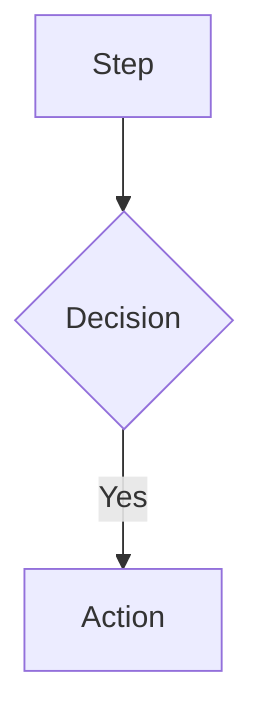

# Complit - Project Context

For full project vision, purpose, and design direction, read [`docs/manifesto.md`](docs/manifesto.md).


---

## Documentation Sync

### Dual-Purpose Docs
Files in `docs/` serve two purposes:
1. **Visual**: Render diagrams with VS Code extensions
2. **Context**: Claude reads them to understand architecture

### File Mappings

| Code Change | Update Docs |
|-------------|-------------|
| `apps/api/src/routes/*.ts` | `docs/api.yaml` |
| `apps/api/src/server.ts` | `docs/architecture.mmd` |
| `apps/web/src/routes/*.tsx` | `docs/flow-*.mmd` |
| `prisma/` or `drizzle/` | `docs/db.dbml` |
| Auth logic | `docs/flow-auth.mmd`, `docs/flow-route-guard.mmd` |

### When to Update

After making code changes, verify if docs need sync:

1. **API changes** → Update `api.yaml` (paths, schemas, responses)
2. **New routes** → Update relevant `flow-*.mmd`
3. **DB schema** → Update `db.dbml` (tables, columns, relations)
4. **Architecture** → Update `architecture.mmd` (services, connections)

### Update Commands

```bash
# Check pending doc updates
cat .claude/pending-doc-updates.json

# Ask Claude to sync docs
claude "Sync documentation with recent code changes"
```

### DBML Format
```dbml
Table name {
  column type [constraints, note: 'description']
}
```

### Mermaid Format


### OpenAPI Format
```yaml
paths:
  /endpoint:
    get:
      summary: Description
      responses:
        '200':
          description: Success
```
